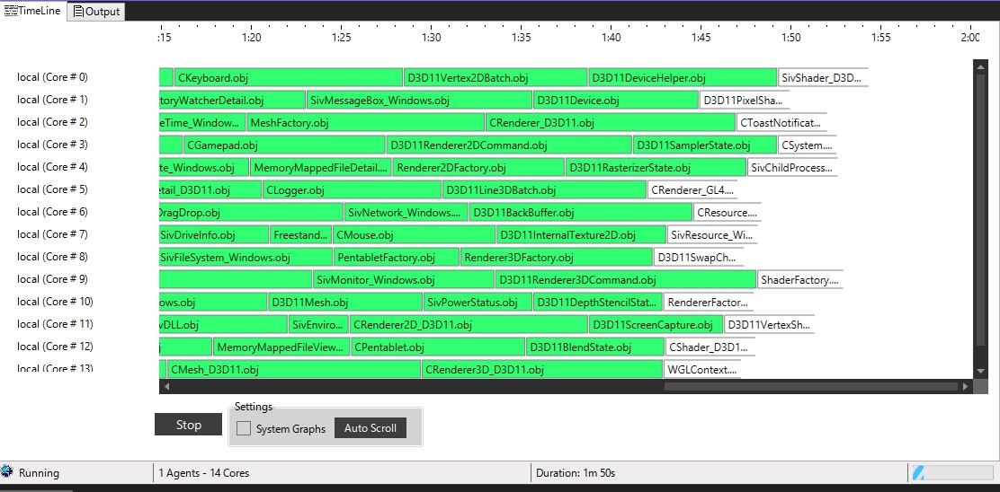
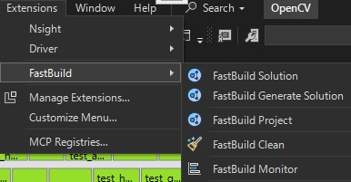
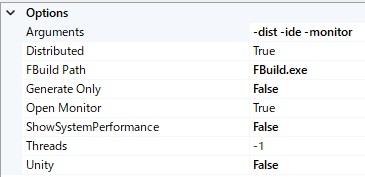

# VSFastBuild
VSFastBuild is an integration of **FASTBuild** for Visual Studio.
It is a refactored version of [msfastbuild](https://github.com/LendyZhang/msfastbuild) and incorporates functionality from [FASTBuildMonitor](https://github.com/yass007/FASTBuildMonitor).

# Features
- Generate FASTBuild's bff files from vcxproj
- List bff files in a solution
- Run FASTBuild
- Monitoring FASTBuild's log

# Menus

Can access from Extensions.

# Options

| Name | Description |
| :--- | :--- |
| Arguments | FASTBuild arguments |
| Enable Generation | Enables generation commands |
| FBuild Path | FASTBuild execution path|
| Generate Only | Don't run FASTBuild process|
| Open Monitor | Automatically open monitor window |
| Unity | Enable Unity (Jambo) build |

# TODO
- Fix warnings
- Completely avoid msvc's rebuilding
- Improve scanning bff files
- Filtering log messages

# License
This project is licensed under the **MIT License**.
Portions of the project are derived from **FASTBuild** and **FASTBuildMonitor**.
For details, see the license files in the `doc` directory.

